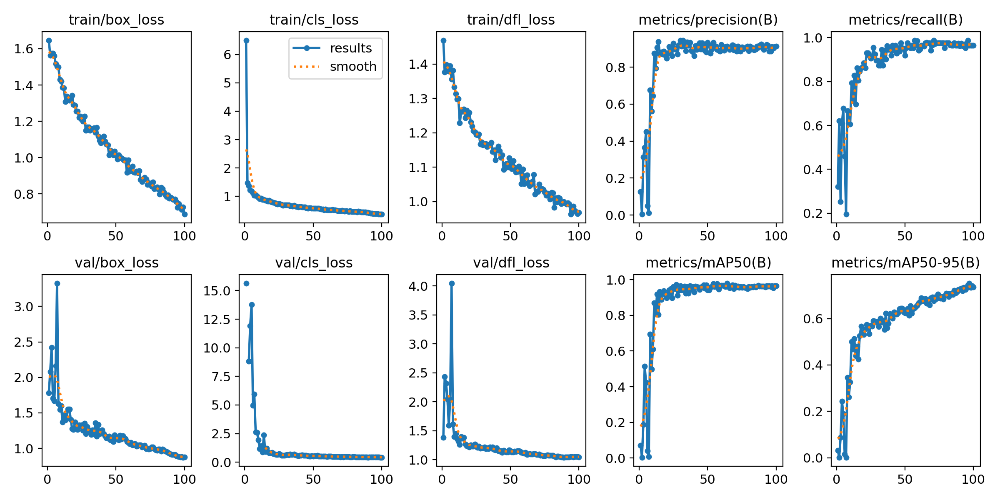
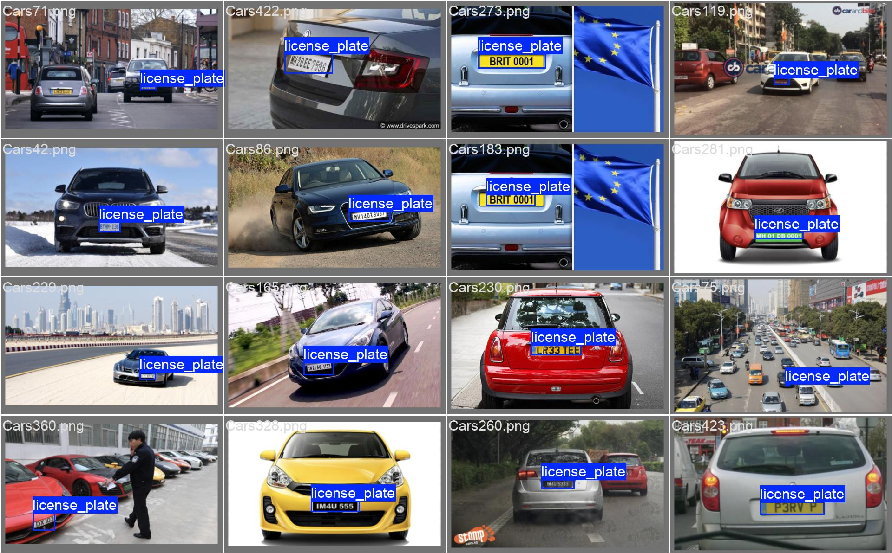
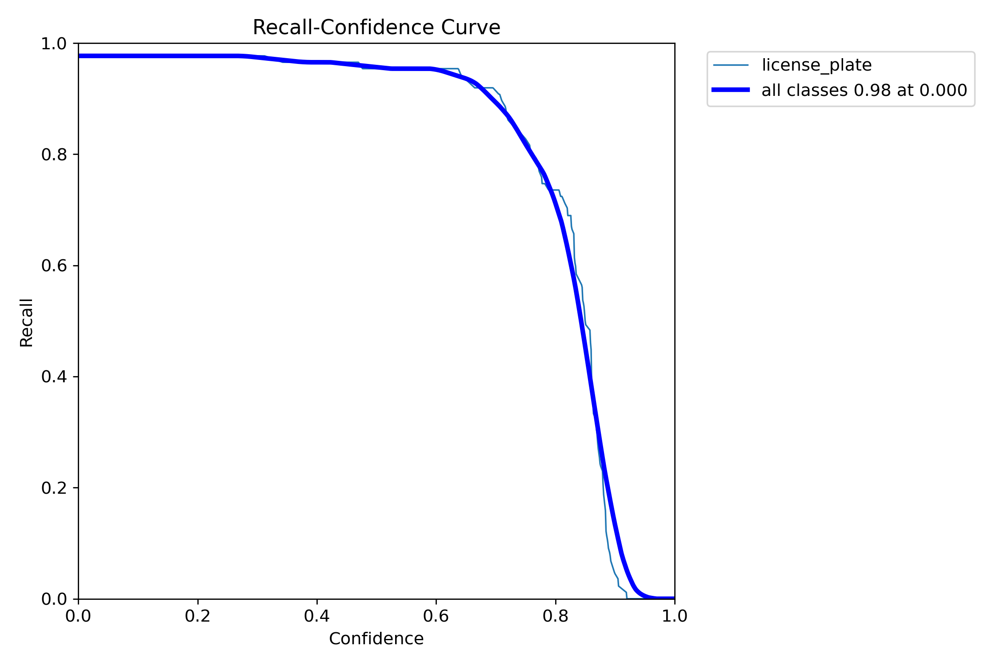
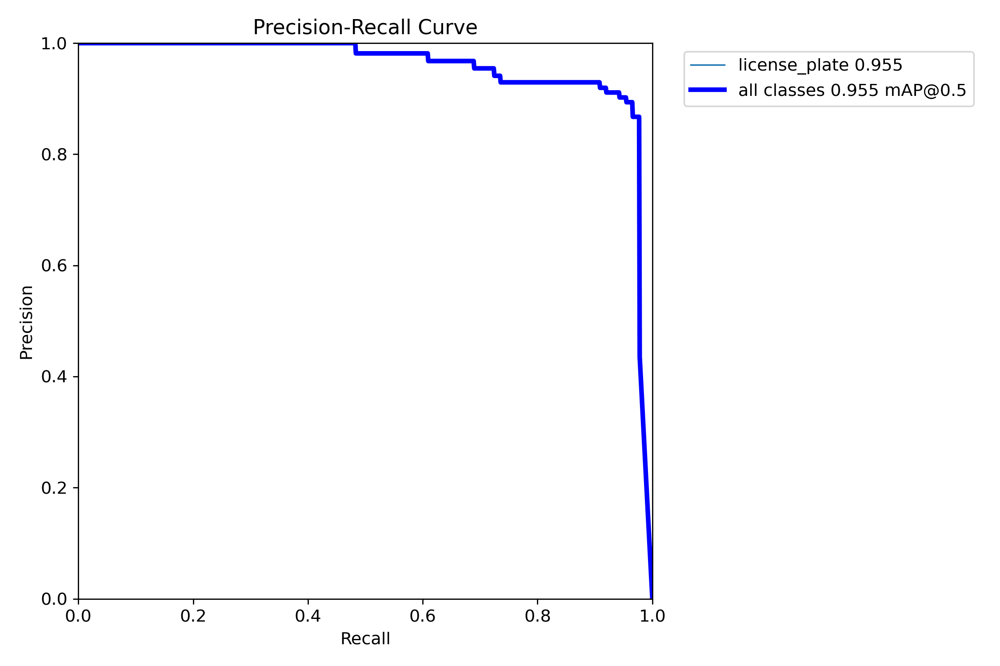
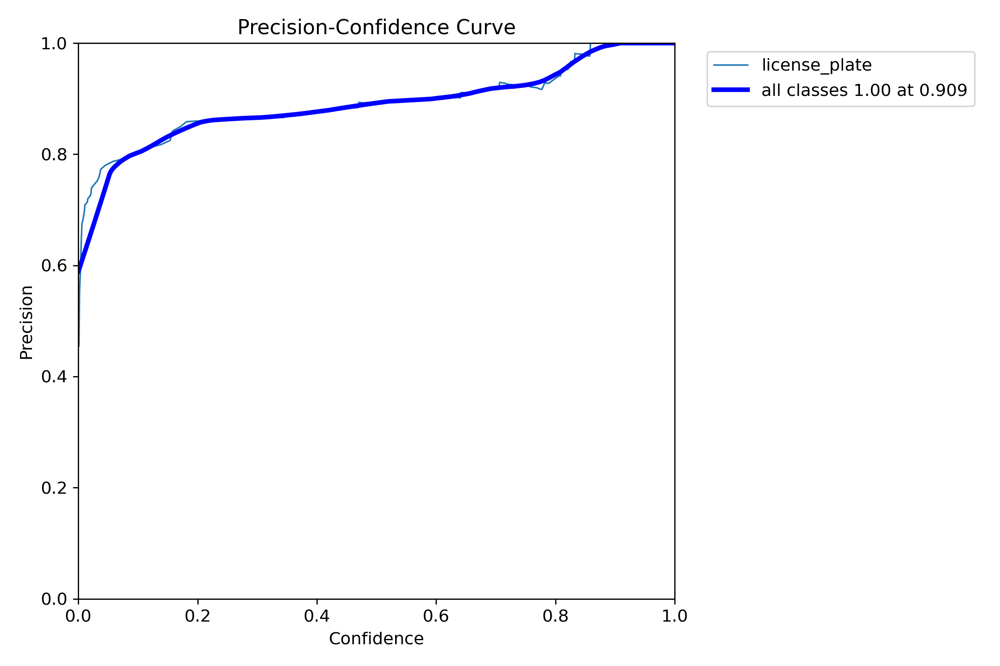
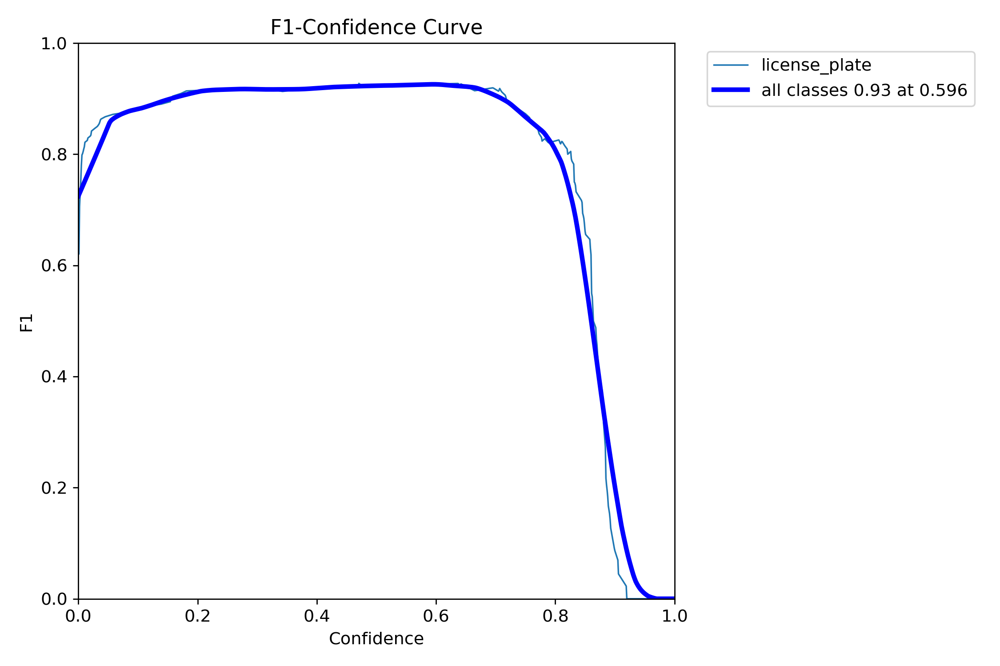

# Nhận dạng biển số xe sử dụng YOLO và EasyOCR

## 1. Tổng quan dự án

Dự án này xây dựng một hệ thống hoàn chỉnh để phát hiện và nhận dạng biển số xe từ video. Quy trình bao gồm hai giai đoạn chính:

1.  **Phát hiện đối tượng (Object Detection)**: Sử dụng mô hình **YOLO (You Only Look Once)** được huấn luyện trên tập dữ liệu tùy chỉnh để xác định chính xác vị trí của biển số xe trong mỗi khung hình của video.
2.  **Nhận dạng ký tự quang học (OCR)**: Sau khi phát hiện và cắt ảnh biển số, hệ thống sử dụng thư viện **EasyOCR** để trích xuất và nhận dạng các ký tự chữ và số trên biển số.

Mục tiêu là tạo ra một ứng dụng có thể xử lý video đầu vào và xuất ra video kết quả với các biển số được phát hiện và nội dung được nhận dạng.

## 2. Huấn luyện mô hình phát hiện biển số

Mô hình YOLO được huấn luyện bằng script `YOLO.py` và tập dữ liệu trong thư mục `License-Plate-Data`.

Kết quả huấn luyện được thể hiện qua biểu đồ dưới đây:



## 3. Đánh giá mô hình (Validation)

Để đánh giá chất lượng mô hình sau khi huấn luyện, bạn cần chạy file `test.py`:

```bash
python test.py
```

Sau khi chạy, bạn sẽ nhận được các kết quả đánh giá. Dưới đây là một ảnh ground truth từ tập validation:



Các biểu đồ dưới đây thể hiện các chỉ số đánh giá:

- BoxR (Recall):
  
- BoxPR (Precision-Recall):
  
- BoxP (Precision):
  
- BoxF1 (F1-score):
  

## 4. Nhận dạng ký tự (OCR) và Demo

Sau khi phát hiện biển số, ảnh được cắt ra và đưa vào EasyOCR.

-   **Bước 1**: Ảnh biển số được chuyển thành ảnh xám để tăng độ tương phản.
-   **Bước 2**: EasyOCR xử lý và trả về danh sách các ký tự nhận dạng được cùng với độ tin cậy.
-   **Bước 3**: Các ký tự có độ tin cậy cao được ghép lại thành chuỗi biển số hoàn chỉnh.

### Demo


## 5. Cách chạy dự án

Quy trình chuẩn để chạy dự án gồm 2 bước chính: Huấn luyện mô hình để phát hiện đối tượng và sau đó sử dụng mô hình đã huấn luyện để nhận dạng biển số trong video.

### 5.1. Cài đặt môi trường

1.  **Clone repository:**
    ```bash
    git clone https://github.com/HieuNM1804/OCR_car_plate.git
    cd OCR_car_plate
    ```

2.  **Tạo môi trường ảo (khuyến khích):**
    ```bash
    python -m venv venv
    source venv/bin/activate  # Trên Linux/macOS
    venv\Scripts\activate    # Trên Windows
    ```

3.  **Cài đặt các thư viện cần thiết:**
    ```bash
    pip install -r requirements.txt
    ```

### 5.2. Bước 1: Huấn luyện mô hình YOLO (Tùy chọn)

Nếu bạn chưa có file trọng số (`.pt`) hoặc muốn huấn luyện lại trên dữ liệu của mình, hãy thực hiện bước này.

1.  **Chuẩn bị dữ liệu**: Đảm bảo dữ liệu của bạn được đặt trong thư mục `License-Plate-Data` và file `data.yaml` được cấu hình đúng.
2.  **Chạy script huấn luyện**:
    ```bash
    python YOLO.py
    ```
3.  **Kết quả**: Mô hình tốt nhất (`best.pt`) sẽ được lưu tại `runs/detect/yolo_car_plate10/weights/`.

### 5.3. Bước 2: Đánh giá mô hình (Validation)

Để đánh giá mô hình sau khi huấn luyện, hãy chạy:

```bash
python test.py
```

Kết quả đánh giá sẽ được in ra màn hình và sinh ra các file hình ảnh, biểu đồ trong thư mục `runs/detect/yolo_car_plate10/` và `runs/detect/val3/`.

### 5.4. Bước 3: Chạy nhận dạng biển số và OCR

Sau khi đã có file trọng số, bạn có thể tiến hành nhận dạng.

1.  **Chuẩn bị video**: Đặt video đầu vào vào thư mục gốc với tên `input.mp4`.
2.  **Cập nhật đường dẫn mô hình**: Mở file `OCR.py` và chắc chắn rằng biến `model_path` đang trỏ đến file `best.pt` bạn vừa huấn luyện hoặc đã có sẵn.
    ```python
    model_path = r"runs/detect/yolo_car_plate10/weights/best.pt"
    ```
3.  **Thực thi**:
    ```bash
    python OCR.py
    ```
4.  **Xem kết quả**: Video kết quả `output.mp4` sẽ được tạo trong thư mục gốc của dự án.
