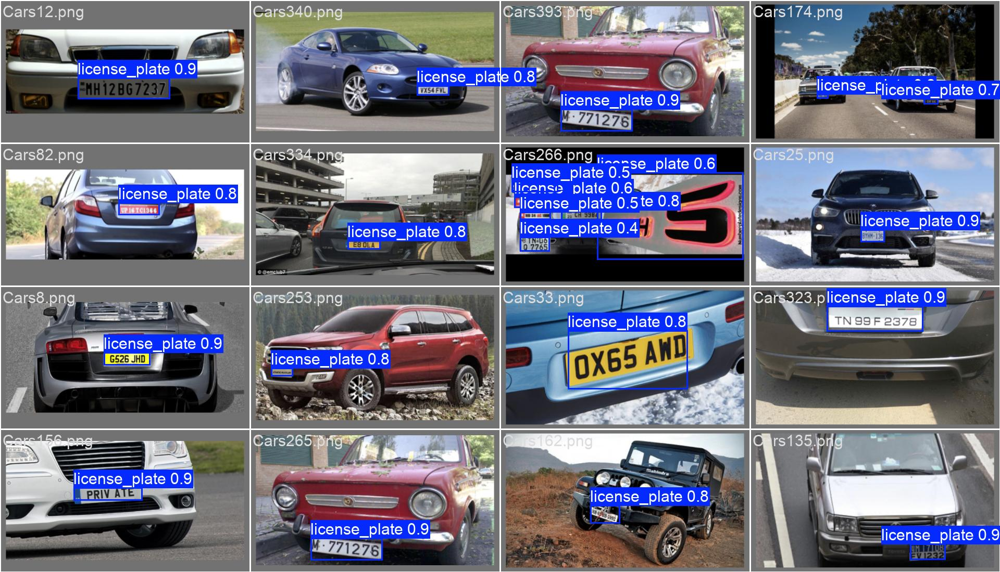
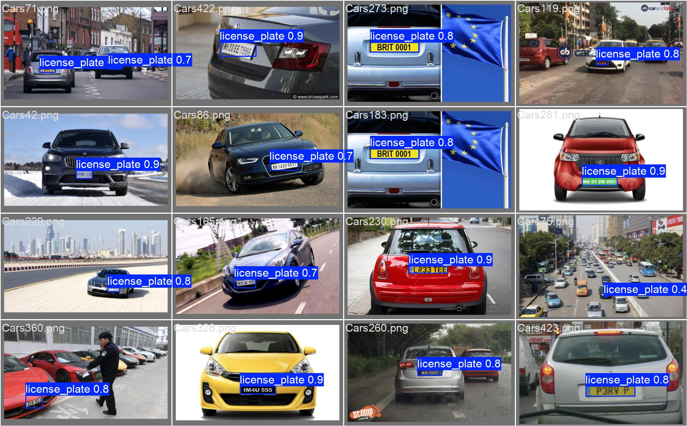
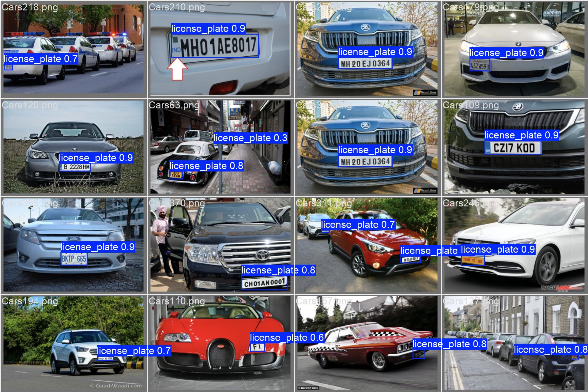

# Nhận diện biển số xe tự động

## Giới thiệu
Dự án xây dựng hệ thống nhận diện biển số xe tự động từ video hoặc hình ảnh, sử dụng mô hình YOLO để phát hiện vị trí biển số và EasyOCR để nhận diện ký tự trên biển số. Ứng dụng phù hợp cho kiểm soát phương tiện, bãi đỗ xe, trạm thu phí, v.v.

## Quy trình thực hiện

### 1. Huấn luyện mô hình phát hiện biển số (YOLO)
Chạy script `YOLO.py` để huấn luyện mô hình phát hiện biển số xe:
```bash
python YOLO.py
```
Trọng số mô hình sẽ được lưu tại `runs/detect/yolo_car_plate/weights/`.


### 2. Quá trình huấn luyện (Training process)
Biểu đồ loss, mAP, precision, recall qua các epoch:

<p align="center">
   
</p>

Các chỉ số chi tiết từng epoch được lưu trong file `results.csv`.

### 3. Đánh giá mô hình trên tập validation
Chạy script `test.py` để đánh giá mô hình với trọng số tốt nhất trên tập validation:
```bash
python test.py
```
Kết quả đánh giá:
- Số ảnh: 87
- Số instance: 87
- Precision (P): 0.885
- Recall (R): 0.975
- mAP50: 0.954
- mAP50-95: 0.745

### 4. Kết quả Object Detection (ảnh demo)
Một số ảnh dự đoán trên tập validation:
<p float="left">
   
   
   
</p>

### 5. Nhận diện ký tự biển số (OCR)
Sau khi phát hiện biển số, script `OCR.py` sẽ cắt vùng biển số và sử dụng EasyOCR để nhận diện ký tự. Kết quả nhận diện sẽ được hiển thị trên video output (`output.mp4`).

## Hướng dẫn sử dụng
1. Huấn luyện mô hình: `python YOLO.py`
2. Đánh giá mô hình: `python test.py`
3. Nhận diện biển số từ video: `python OCR.py` (video đầu vào: `input.mp4`)

## Yêu cầu
- Python 3.8+
- ultralytics
- easyocr
- opencv-python
- numpy

Cài đặt nhanh:
```bash
pip install ultralytics easyocr opencv-python numpy
```

## Cấu trúc thư mục
- `YOLO.py`: Huấn luyện mô hình YOLO
- `OCR.py`: Nhận diện biển số từ video
- `test.py`: Đánh giá mô hình
- `yolo11s.pt`: Trọng số mô hình mẫu
- `License-Plate-Data/`: Dữ liệu huấn luyện/kiểm thử
- `runs/`: Kết quả huấn luyện, log, ảnh demo


## Quy trình huấn luyện và đánh giá

### 1. Huấn luyện mô hình Object Detection (YOLO)
- Chạy script `YOLO.py` để huấn luyện mô hình phát hiện biển số xe:
   ```bash
   python YOLO.py
   ```
- Trọng số mô hình sẽ được lưu tại `runs/detect/yolo_car_plate/weights/`.

### 2. Đánh giá mô hình trên tập validation
- Chạy script `test.py` để đánh giá mô hình với trọng số tốt nhất trên tập validation:
   ```bash
   python test.py
   ```
- Kết quả đánh giá:
   - Số ảnh: 87
   - Số instance: 87
   - Precision (P): 0.885
   - Recall (R): 0.975
   - mAP50: 0.954
   - mAP50-95: 0.745
   - Tốc độ: ~0.8ms preprocess, 8.6ms inference, 3.1ms postprocess mỗi ảnh

### 3. Kết quả Object Detection (ảnh demo)
Dưới đây là một số ảnh dự đoán trên tập validation:

<p float="left">
   
   
   
</p>

Ngoài ra, các biểu đồ PR curve, confusion matrix cũng được lưu trong thư mục `runs/detect/val3/`.

### 4. Nhận diện ký tự biển số (OCR)
- Sau khi phát hiện biển số, script `OCR.py` sẽ cắt vùng biển số và sử dụng EasyOCR để nhận diện ký tự.
- Kết quả nhận diện sẽ được hiển thị trên video output (`output.mp4`) và bảng thông tin bên cạnh khung hình.

## Yêu cầu
- Python 3.8+
- ultralytics
- easyocr
- opencv-python
- numpy

Cài đặt nhanh:
```bash
pip install ultralytics easyocr opencv-python numpy
```

## Định dạng dữ liệu huấn luyện (YOLO)
- Ảnh: `License-Plate-Data/train/images/`, `test/images/`
- Nhãn: `License-Plate-Data/train/labels/`, `test/labels/` (định dạng YOLO: class x_center y_center width height)
- File cấu hình: `License-Plate-Data/data.yaml`
   ```yaml
   train: "D:/yolo_car_plate/License-Plate-Data/train"
   val: "D:/yolo_car_plate/License-Plate-Data/test"
   nc: 1
   names: ["license_plate"]
   ```

## Demo


## Tác giả
- HieuNM1804
- Dựa trên mô hình YOLO và EasyOCR

→ Kích thước đầu ra:
$$7 \times 7 \times (2 \times 5 + 20) = 7 \times 7 \times 30$$


##  3. Biểu diễn đầu ra

Mỗi cell dự đoán:

* **2 bounding boxes**, mỗi box gồm 5 giá trị:
  $$(x, y, w, h, C)$$
  Trong đó:

  * $x, y$: tọa độ tâm box, **chuẩn hóa** theo cell.
  * $w, h$: chiều rộng và cao, **chuẩn hóa theo toàn ảnh**.
  * $C$: confidence score (độ tin cậy của box).

**Confidence score** được định nghĩa là:

$$
C = P(\text{object}) \times \text{IoU}_{\text{pred, truth}}
$$

Trong đó:

* $$P(\text{object})$$ là xác suất có vật thể trong cell.
* $$\text{IoU}_{\text{pred, truth}}$$ là giao trên hợp giữa box dự đoán và box thật.

Ngoài ra, mỗi cell còn dự đoán:

* **20 class probabilities**:
  $$P(\text{class}_i | \text{object})$$


## 4. Pipeline xử lý

1. **Chia ảnh đầu vào** thành $7 \times 7$ grid.
2. **Mỗi cell** dự đoán:

   * 2 bounding boxes
   * 1 confidence score cho mỗi box
   * 20 class probabilities
3. **Tính toán class-specific confidence score**:
   $P(\text{class}*i) \times \text{IoU}*{\text{pred, truth}}$
4. **Áp dụng Non-Max Suppression (NMS)** để loại bỏ các box trùng lặp.

## 5. Hàm mất mát (Loss function)

YOLOv1 sử dụng một loss function duy nhất để huấn luyện toàn bộ mô hình. Loss này là tổng bình phương sai số (sum-squared error) giữa giá trị dự đoán và ground truth.

Tổng quát, loss bao gồm 3 phần chính:

$$\text{Loss} = \text{Loss}*{\text{coord}} + \text{Loss}*{\text{confidence}} + \text{Loss}_{\text{class}}$$

### 1. Localization Loss (tọa độ box)

$$\lambda_{\text{coord}} \sum_{i=0}^{S^2} \sum_{j=0}^{B} \mathbb{1}_{ij}^{\text{obj}}
\left[
(x_i - \hat{x}_i)^2 + (y_i - \hat{y}_i)^2 + (\sqrt{w_i} - \sqrt{\hat{w}_i})^2 + (\sqrt{h_i} - \sqrt{\hat{h}_i})^2
\right]$$

→ Mục tiêu: Dự đoán chính xác tọa độ và kích thước box.

### 2. Confidence Loss

* Với box **có vật thể**:
  $$\sum_{i=0}^{S^2} \sum_{j=0}^{B} \mathbb{1}_{ij}^{\text{obj}} (C_i - \hat{C}_i)^2$$
* Với box **không có vật thể**:
  $$\lambda_{\text{noobj}} \sum_{i=0}^{S^2} \sum_{j=0}^{B} \mathbb{1}_{ij}^{\text{noobj}} (C_i - \hat{C}_i)^2$$

### 3. Classification Loss

$$\sum_{i=0}^{S^2} \mathbb{1}*i^{\text{obj}} \sum*{c \in \text{classes}} (p_i(c) - \hat{p}_i(c))^2$$

###  Hệ số điều chỉnh:

* $\lambda_{\text{coord}} = 5$ — tăng trọng số cho phần localization.
* $\lambda_{\text{noobj}} = 0.5$ — giảm ảnh hưởng của các cell không có vật thể.


##  6. Kết quả và hiệu năng

* **Dataset**: Pascal VOC 2007/2012
* **Tốc độ**: ~45 FPS (phiên bản full YOLO)
* **Tốc độ nhanh (Fast YOLO)**: ~155 FPS
* **mAP**: ~63.4% trên VOC 2007


##  7. Hạn chế của YOLOv1

1. **Không tốt với vật thể nhỏ**
   → Vì chia lưới 7×7, một cell chỉ dự đoán 1 vật thể.

2. **Không phát hiện tốt các vật thể gần nhau**
   → Nếu 2 vật thể nằm trong cùng 1 cell, YOLO chỉ dự đoán được 1.

3. **Localization chưa chính xác**
   → Dự đoán bounding box còn sai lệch ở góc hoặc tỷ lệ.

4. **Tổng hợp loss không cân bằng**
   → Dễ bị chi phối bởi lỗi confidence.


#  YOLOv2 


##  1. Tổng quan ý tưởng

YOLOv2 khắc phục nhiều hạn chế của YOLOv1:

* Thêm **anchor boxes** giống Faster R-CNN.
* Áp dụng **batch normalization**, **high-resolution classifier**, **multi-scale training**.
* Tích hợp **WordTree** để huấn luyện chung 2 dataset (VOC + ImageNet).


YOLOv2 giới thiệu backbone mới: **Darknet-19**
(19 convolutional layers + 5 maxpool layers).

| Loại layer      | Số lượng | Kích thước kernel                  | Ghi chú                      |
| --------------- | -------- | ---------------------------------- | ---------------------------- |
| Convolution     | 19       | $$1 \times 1$$ hoặc $$3 \times 3$$ | Có BatchNorm + LeakyReLU     |
| MaxPooling      | 5        | $$2 \times 2$$                     | Giảm kích thước feature map  |
| Fully Connected | 0        | —                                  | Không còn dùng FC như YOLOv1 |

* Input: $$416 \times 416$$
* Output feature map: $$13 \times 13$$


##  3. Các cải tiến chính so với YOLOv1

### 1. Batch Normalization (BN)

Thêm **BatchNorm** vào mọi convolution layer giúp:

* Tăng độ ổn định khi huấn luyện.
* Loại bỏ nhu cầu sử dụng dropout.
* Tăng mAP ~2%.

$$
\text{BN}(x) = \frac{x - \mu_B}{\sqrt{\sigma_B^2 + \epsilon}}
$$


### 2. High-Resolution Classifier

Trong YOLOv1, mạng được huấn luyện phân loại ảnh kích thước $$224 \times 224$$ (giống ImageNet).
YOLOv2 thay đổi thành $$448 \times 448$$ **trước khi huấn luyện detection**, giúp mạng **thích nghi với ảnh độ phân giải cao hơn**.


### 3. Anchor Boxes

YOLOv2 **chuyển từ trực tiếp dự đoán $(x, y, w, h)$ sang sử dụng anchor boxes** giống như Faster R-CNN và SSD.

Giờ đây, mỗi cell dự đoán **n anchor boxes** (thường là 5), giúp mô hình:

* Phát hiện **nhiều vật thể** trong 1 cell.
* **Ổn định hơn** trong huấn luyện.

Cách xác định anchor box:

* Dùng **K-means clustering** trên ground truth boxes để tìm 5 anchor tối ưu.
* Khoảng cách được đo bằng:
  $$
  d(\text{box}_1, \text{box}_2) = 1 - \text{IoU}(\text{box}_1, \text{box}_2)
  $$

Cách tính toán bounding box dự đoán:

$$
\begin{aligned}
b_x &= \sigma(t_x) + c_x \
b_y &= \sigma(t_y) + c_y \
b_w &= p_w \cdot e^{t_w} \
b_h &= p_h \cdot e^{t_h}
\end{aligned}
$$

Trong đó:

* $(c_x, c_y)$ là tọa độ cell trong grid.
* $(p_w, p_h)$ là kích thước anchor box.
* $(t_x, t_y, t_w, t_h)$ là giá trị mạng dự đoán.
* $\sigma$ là hàm sigmoid đảm bảo $b_x, b_y$ trong [0, 1].


### 4. Dimension Clusters

YOLOv2 **tự động chọn anchor box kích thước tối ưu** bằng K-means, thay vì đặt thủ công như Faster R-CNN.

→ Các anchor phản ánh **phân bố thực tế** của kích thước vật thể trong tập huấn luyện.


### 5. Fine-grained Features

YOLOv2 bổ sung **skip connection** (giống ResNet) từ layer trung gian sang feature map cuối.

Điều này giúp mô hình:

* Giữ lại thông tin chi tiết về **vị trí (spatial)**.
* Phát hiện vật thể nhỏ tốt hơn.


### 6. Multi-Scale Training

Mỗi 10 batch, YOLOv2 **thay đổi kích thước đầu vào** ngẫu nhiên trong khoảng 320 → 608 (bội số của 32).

→ Giúp mạng **mạnh mẽ hơn với nhiều độ phân giải**,
→ Có thể chạy nhanh hoặc chính xác tùy tình huống.


### 7. WordTree + Hierarchical Classification

YOLOv2 được huấn luyện trên **2 dataset song song**:

* Pascal VOC (20 lớp có bounding box)
* ImageNet (9000 lớp chỉ có label)

Bằng cách kết hợp chúng qua cấu trúc WordTree (dựa trên WordNet), mô hình học được **quan hệ phân cấp giữa các lớp**.

Ví dụ:


Animal → Dog → German Shepherd

Khi đó, nếu ảnh là “German Shepherd” nhưng YOLO chỉ đoán “Dog”, mô hình vẫn được xem là đúng một phần.

